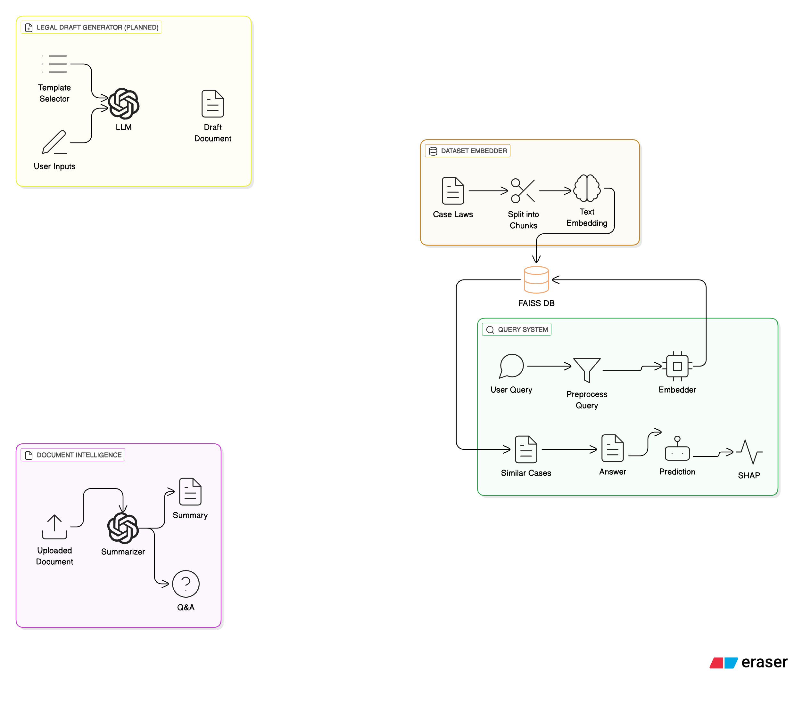

# ⚖️ Verdict AI: Legal AI Assistant

A comprehensive AI-powered legal assistant built with Streamlit that provides advanced legal document analysis, case outcome prediction, document summarization, and legal document generation capabilities.


## System Architecture



## 🚀 Features

### 📝 Legal Question Analysis
- **Case Similarity Search**: Find similar historical cases from a database of Indian court cases
- **AI-Powered Analysis**: Generate comprehensive legal analysis based on similar precedents
- **Citation & Precedent Discovery**: Identify relevant legal precedents and citations
- **Downloadable Reports**: Export analysis results in text format

### 📄 Case Outcome Prediction
- **ML-Based Predictions**: Predict case outcomes using machine learning models
- **Confidence Scoring**: Get confidence levels for predictions
- **SHAP Explanations**: Understand which factors influence the prediction
- **Historical Case Comparison**: Compare with similar historical cases

### 📋 Document Summarization & Q&A
- **Multi-Format Support**: Process PDF, DOCX, and TXT files
- **Multiple Summary Types**:
  - Executive Summary
  - Detailed Summary
  - Key Points Extraction
  - Roles & Parties Identification
  - Timeline Creation
  - Risk Analysis
  - Comprehensive Analysis
- **Custom Q&A**: Ask specific questions about uploaded documents
- **Export Options**: Download summaries and Q&A results

### 📃 Legal Document Generator
- **AI-Powered Templates**: Generate professional legal documents with AI assistance
- **Document Types**:
  - Non-Disclosure Agreement (NDA)
  - Employment Agreement
  - Service Agreement
  - Freelance Contract
  - Lease Agreement
- **Smart Clause Generation**: AI-generated legal clauses tailored to your needs
- **Multiple Export Formats**: PDF, DOCX, and TXT formats

## 🛠️ Installation

### Prerequisites
- Python 3.8 or higher
- Gemini API key from Google AI Studio

### Setup Steps

1. **Clone the repository**
   ```bash
   git clone <repository-url>
   cd verdict-ai
   ```

2. **Install dependencies**
   ```bash
   pip install -r requirements.txt
   ```

3. **Set up environment variables**
   Create a `.env` file in the root directory:
   ```env
   GEMINI_API_KEY=your_gemini_api_key_here
   ```

4. **Install additional dependencies**
   ```bash
   # For PDF processing
   pip install PyPDF2 python-docx

   # For machine learning features
   pip install scikit-learn sentence-transformers faiss-cpu

   # For document generation
   pip install fpdf2

   # For dataset processing
   pip install datasets transformers
   ```

## 📦 Required Dependencies

Create a `requirements.txt` file with the following dependencies:

```txt
streamlit>=1.28.0
google-generativeai>=0.3.0
python-dotenv>=1.0.0
PyPDF2>=3.0.0
python-docx>=0.8.11
sentence-transformers>=2.2.0
faiss-cpu>=1.7.4
scikit-learn>=1.3.0
numpy>=1.24.0
pandas>=2.0.0
datasets>=2.14.0
transformers>=4.30.0
fpdf2>=2.7.0
shap>=0.42.0
```

## 🚀 Usage

### Running the Application

1. **Start the Streamlit app**
   ```bash
   streamlit run app.py
   ```

2. **Open your browser** and navigate to `http://localhost:8501`

3. **Enter your Gemini API key** in the sidebar

### Getting Your Gemini API Key

1. Visit [Google AI Studio](https://makersuite.google.com/app/apikey)
2. Sign in with your Google account
3. Create a new API key
4. Copy the API key and paste it in the application sidebar

### Using the Features

#### Legal Question Analysis
1. Navigate to the "Legal Question Analysis" tab
2. Enter your legal question or scenario
3. Click "Analyze Question"
4. Review the AI-generated analysis and similar cases
5. Download the analysis report

#### Case Outcome Prediction
1. Go to the "Case Prediction" tab
2. Upload a case document (PDF, DOCX, or DOC)
3. Wait for the analysis to complete
4. Review the prediction results and confidence score
5. Examine similar historical cases

#### Document Summarization
1. Select the "Document Summarization & Query" tab
2. Upload your legal document
3. Choose a summary type or ask custom questions
4. Generate summaries or get answers to your queries
5. Download the results

#### Legal Document Generation
1. Access the "Legal Document Generator" tab
2. Select the type of legal document you need
3. Fill in the required information
4. Let AI generate the legal clauses
5. Review and download the document in your preferred format

## 🗂️ Project Structure

```
verdict-ai/
├── app.py                          # Main Streamlit application
├── config.py                       # Configuration and sidebar setup
├── document_generator.py           # Document generation utilities
├── requirements.txt                # Python dependencies
├── README.md                       # This file
├── .env                           # Environment variables (create this)
├── app/
│   ├── __init__.py
│   ├── config.py                  # API key configuration
│   ├── document_loader.py         # Document loading utilities
│   ├── genai_wrapper.py          # Gemini AI wrapper
│   ├── query_system.py           # Document query system
│   ├── summarizer.py             # Document summarization
│   ├── text_processor.py         # Text processing utilities
│   └── utils.py                  # General utilities
├── tabs/
│   ├── __init__.py
│   ├── legal_analysis.py         # Legal analysis tab
│   ├── case_prediction.py        # Case prediction tab
│   ├── document_summary.py       # Document summarization tab
│   └── document_generator.py     # Document generation tab
├── utils/
│   ├── case_predictor.py         # ML-based case prediction
│   ├── dataset_loader.py         # Legal dataset loading
│   ├── embedding_search.py       # Similarity search
│   ├── extractors.py             # Text extraction utilities
│   ├── gemini_interface.py       # Gemini API interface
│   └── save_metadata.py          # Metadata saving utilities
└── templates/
    ├── nda_template.txt          # NDA template
    ├── employment_template.txt   # Employment agreement template
    ├── service_template.txt      # Service agreement template
    ├── freelance_template.txt    # Freelance contract template
    └── lease_template.txt        # Lease agreement template
```

## 🤖 AI Models Used

- **Gemini 1.5 Flash**: For text generation, summarization, and analysis
- **all-MiniLM-L6-v2**: For sentence embeddings and similarity search
- **Random Forest**: For case outcome prediction
- **FAISS**: For efficient similarity search

## 📊 Data Sources

The application uses the following Hugging Face datasets:
- `santoshtyss/indian_courts_cases`
- `rishiai/indian-court-judgements-and-its-summaries`
- `maheshCoder/indian_court_cases`

## ⚠️ Legal Disclaimer

**Important**: This tool provides general legal information and document templates for educational purposes only. The AI-generated content should be reviewed by qualified legal professionals before use in any legal context. The developers are not responsible for any legal consequences arising from the use of this tool.

## 🔒 Privacy & Security

- API keys are stored locally and not transmitted except to Google's Gemini API
- Uploaded documents are processed locally and temporarily
- No user data is permanently stored on external servers
- All document processing happens in your local environment

## 🐛 Troubleshooting

### Common Issues

1. **API Key Issues**
   - Ensure your Gemini API key is valid and has sufficient quota
   - Check that the API key is correctly set in the `.env` file

2. **Dataset Loading Errors**
   - Internet connection required for initial dataset download
   - Datasets will be cached locally after first load

3. **Document Processing Errors**
   - Ensure uploaded files are not corrupted
   - Check file size limits (recommended < 10MB)

4. **Memory Issues**
   - Close other applications to free up RAM
   - Consider using smaller batch sizes for large documents

### Error Logs
Check the Streamlit console output for detailed error messages and stack traces.

## 🤝 Contributing

1. Fork the repository
2. Create a feature branch (`git checkout -b feature/amazing-feature`)
3. Commit your changes (`git commit -m 'Add amazing feature'`)
4. Push to the branch (`git push origin feature/amazing-feature`)
5. Open a Pull Request


## 🙏 Acknowledgments

- Google AI for the Gemini API
- Hugging Face for the legal datasets
- Streamlit for the web application framework
- The open-source community for various libraries and tools

## 📞 Support

For support, please:
1. Check the troubleshooting section above
2. Review the error logs in the console
3. Create an issue in the GitHub repository
4. Contact the development team

---
